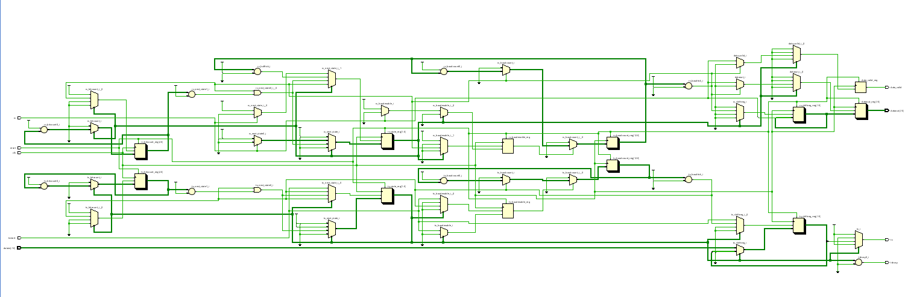

# FPGA-Based UART Transceiver

A synthesizable Universal Asynchronous Receiver Transmitter (UART) implemented in **Verilog HDL** for FPGA applications. This project integrates UART transmission and reception into a single RTL module using independent Finite State Machines (FSMs), making it suitable for learning digital design, FPGA development, and serial communication protocols.

---

# Overview

Universal Asynchronous Receiver Transmitter (UART) is one of the most widely used serial communication protocols in embedded systems and digital hardware. This project implements both the transmitter (TX) and receiver (RX) in Verilog HDL, enabling serial communication between digital devices without requiring a separate clock line.

The design is fully synchronous, synthesizable, and intended for FPGA implementation. Separate FSMs are used for transmission and reception to provide independent operation while sharing a common baud rate configuration.

---

# Features

* UART Transmitter (TX)
* UART Receiver (RX)
* Integrated UART module
* Independent TX and RX Finite State Machines
* Configurable baud rate generator
* Start bit detection
* Mid-bit sampling for reliable reception
* Stop bit verification
* Busy status indication
* Data valid flag
* Synthesizable Verilog RTL
* FPGA-oriented design

---

# System Specifications

| Parameter       | Value                                      |
| --------------- | ------------------------------------------ |
| Language        | Verilog HDL                                |
| Design Style    | Register Transfer Level (RTL)              |
| Communication   | UART (Asynchronous Serial)                 |
| Frame Format    | 8 Data Bits, No Parity, 1 Stop Bit (8-N-1) |
| Architecture    | Dual FSM (TX & RX)                         |
| Target Platform | FPGA                                       |

---

# UART Frame Format

Each transmitted frame consists of:

| Field     | Bits |
| --------- | ---- |
| Start Bit | 1    |
| Data Bits | 8    |
| Parity    | None |
| Stop Bit  | 1    |

Frame Structure:

```
| Start | D0 | D1 | D2 | D3 | D4 | D5 | D6 | D7 | Stop |
```

---

# Module Interface

## Inputs

| Signal    | Width | Description                    |
| --------- | ----- | ------------------------------ |
| `clk`     | 1     | System clock                   |
| `reset`   | 1     | Active-high reset              |
| `rx`      | 1     | UART receive input             |
| `datain`  | 8     | Parallel data for transmission |
| `txstart` | 1     | Starts UART transmission       |

---

## Outputs

| Signal       | Width | Description                   |
| ------------ | ----- | ----------------------------- |
| `tx`         | 1     | UART transmit output          |
| `txbusy`     | 1     | Indicates transmitter is busy |
| `dataout`    | 8     | Received parallel data        |
| `data_valid` | 1     | Indicates valid received data |

---

# Baud Rate Generator

The UART timing is generated using programmable counters.

```verilog
localparam BAUD_MAX      = 13'd5207;
localparam HALF_BAUD_MAX = 13'd2603;
```

* **BAUD_MAX** defines the number of clock cycles corresponding to one UART bit period.
* **HALF_BAUD_MAX** is used for mid-bit sampling during reception to improve start-bit detection accuracy.

---

# Transmitter Operation

The transmitter performs the following sequence:

1. Waits for `txstart`.
2. Loads the input byte into a shift register.
3. Sends the start bit.
4. Transmits the eight data bits (LSB first).
5. Sends the stop bit.
6. Returns to the idle state.

---

# Receiver Operation

The receiver continuously monitors the RX line.

1. Detects the start bit.
2. Samples the signal at the middle of the start bit.
3. Receives eight serial data bits.
4. Verifies the stop bit.
5. Transfers the received byte to `dataout`.
6. Asserts `data_valid` for one clock cycle.

---

# Finite State Machines

Both transmitter and receiver use independent Moore-style FSMs.

### Transmitter States

| State | Function                      |
| ----- | ----------------------------- |
| IDLE  | Wait for transmission request |
| START | Transmit start bit            |
| DATA  | Transmit 8 data bits          |
| STOP  | Transmit stop bit             |

---

### Receiver States

| State | Function                                |
| ----- | --------------------------------------- |
| IDLE  | Wait for start bit                      |
| START | Validate start bit                      |
| DATA  | Receive 8 data bits                     |
| STOP  | Verify stop bit and store received data |

---

# Design Highlights

* Separate FSMs for TX and RX
* Independent baud counters
* Shift-register based serial communication
* Mid-bit sampling for reliable reception
* Parameterized baud timing
* Fully synthesizable RTL
* Suitable for FPGA implementation

---

# RTL Schematic

The RTL schematic generated after synthesis illustrates the hardware inferred from the Verilog RTL design.

> *(Add **`rtl_schematic.png`** to the repository and reference it below.)*

```html
<p align="center">
  
</p>
```

---

# Project Structure

```
FPGA-UART-Transceiver/
│── uart.v
│── README.md
│── LICENSE
└── Images/
    └── rtl_schematic.png
```

---

# Development Tools

* Verilog HDL
* AMD Vivado Design Suite

---
# Author

**Huzaifa**

Electrical Engineering Student

National University Of Science & Technology (NUST)

---

# License

This project is licensed under the MIT License.
